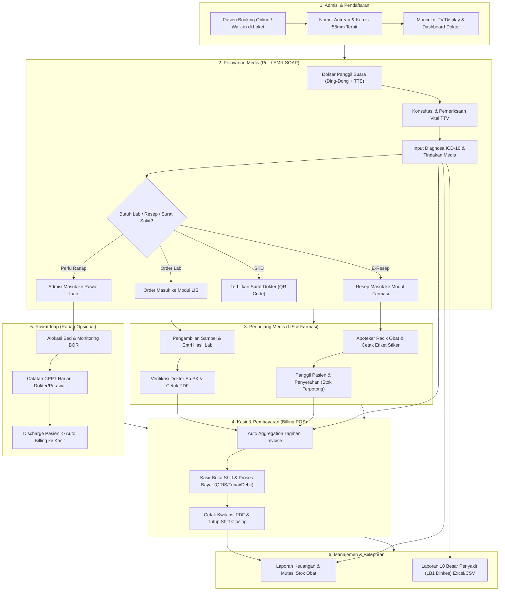

# Panduan Simulasi Alur End-to-End (E2E) SehatKu HMS

Dokumen ini merupakan panduan operasional resmi untuk melakukan pengujian dan simulasi alur end-to-end (*Patient Journey & Clinical Workflow*) pada sistem SehatKu HMS, mulai dari pendaftaran pasien hingga penutupan kasir dan pelaporan dinas kesehatan.

---

## 1. Peta Alur Sistem (System Architecture & Journey Flow)



---

## 2. Kredensial Akun Pengujian & URL Portal

Gunakan kredensial default dari seed database berikut untuk pengujian multi-role:

| Role Pengguna | Email | Password | URL Route | Fungsi & Kewenangan |
| :--- | :--- | :--- | :--- | :--- |
| **Hospital Admin / Kasir / Farmasi** | `admin@sehatku.id` | `password123` | `/admin` | Mengelola antrean, rawat inap, LIS lab, apotek, shift kasir, dan laporan klinik. |
| **Dokter Spesialis Poli** | `doctor@sehatku.id` | `password123` | `/doctor` | Panggil antrean pasien, input EMR SOAP, diagnosa ICD-10, resep obat, order lab, dan SKD. |
| **Dokter Gigi / Spesialis Lain** | `rafi@sehatku.id` | `password123` | `/doctor` | Akun dokter alternatif untuk pengujian poli gigi & spesialisasi berbeda. |
| **Pasien Terdaftar** | `patient@sehatku.id` | `password123` | `/patient` | Booking janji temu online, pantau antrean live, unduh kwitansi & surat medis. |
| **Layar TV Ruang Tunggu** | *(Publik / Tanpa Login)* | - | `/queue-display` | Display monitor ruang tunggu dengan nada bel *Ding-Dong* dan suara TTS pemanggil otomatis. |

---

## 3. Matriks Kesiapan Komponen E2E

Seluruh komponen berikut telah terhubung secara penuh antara database PostgreSQL, backend NestJS, dan frontend Flutter:

| Modul / Komponen | Endpoint Backend Terkait | Tampilan UI & Modal Terkait | Fitur Output Riil |
| :--- | :--- | :--- | :--- |
| **1. Otentikasi & RBAC** | `POST /auth/login` | `LoginScreen` | Akses terkunci sesuai role (JWT Token & UUID v4). |
| **2. Suara & TV Display** | `GET /appointments`, Web Audio API | `QueueTvDisplayScreen` | Suara ding-dong harmonik F5$\to$C5 & TTS bahasa Indonesia. |
| **3. Pendaftaran & Loket** | `POST /appointments`, `POST /patients` | `AdminCreateAppointmentScreen` | Terbit nomor antrean baru & dialog cetak karcis 58mm. |
| **4. EMR SOAP & Tindakan** | `POST /medical-records`, `GET /procedures` | `ClinicalEncounterScreen` | Kalkulasi BMI otomatis, ICD-10 search, input tindakan. |
| **5. Surat Dokter (SKD)** | `POST /medical-records/certificates` | `MedicalCertificateDialog` | Cetak Surat Sakit / Surat Sehat PDF ber-QR Code resmi. |
| **6. Farmasi & Dispensing** | `GET/PUT /pharmacy/prescriptions` | `AdminPharmacyTab`, `MedicineLabelPrintDialog` | Pemotongan stok obat, cetak etiket putih/biru 58/80mm. |
| **7. Laboratorium & LIS** | `GET/POST/PUT /laboratory/orders` | `AdminLaboratoryTab`, `LabResultPrintDialog` | Entri hasil lab, auto flag kritis, verifikasi Sp.PK, cetak A4. |
| **8. Rawat Inap (Ranap)** | `GET/POST/PUT /inpatient/*` | `AdminInpatientTab`, dialog CPPT/Admisi/Discharge | Monitoring BOR bed visual, CPPT visit harian, discharge billing. |
| **9. Kasir POS & Shift** | `POST /billing/shifts/*`, `POST /billing/invoices/*` | `AdminBillingTab`, `CashierShiftDialog`, `OfficialReceiptDialog` | Buka/tutup kasir, hitung selisih kas fisik, cetak kwitansi PDF. |
| **10. Laporan & LB1 Dinkes** | `GET /analytics/*` | `AdminReportsTab` | Export file CSV (UTF-8 BOM) kompatibel Excel & Sheets. |

---

## 4. Langkah Simulasi Skenario Praktis

Untuk menguji alur secara simultan, disarankan membuka **3 jendela browser berdampingan**:
- **Jendela 1**: `http://localhost:8080/#/queue-display` (TV Display)
- **Jendela 2**: `http://localhost:8080/#/admin` (Login Admin: `admin@sehatku.id`)
- **Jendela 3**: `http://localhost:8080/#/doctor` (Login Dokter: `doctor@sehatku.id`)

---

### 🟢 Skenario A: Rawat Jalan Poliklinik $\to$ Farmasi $\to$ Kasir

1. **Pendaftaran Pasien (Loket Admisi)**:
   - Di Jendela 2 (Admin), masuk ke tab **Reservasi & Antrean** $\to$ klik **Daftar Reservasi / Walk-in**.
   - Cari pasien *Nadia Putri* atau masukkan nama pasien walk-in baru.
   - Pilih Dokter: *dr. Maya Pratama, Sp.JP*, Tanggal: *Hari Ini*.
   - Klik **Daftarkan Reservasi & Terbitkan Antrean**.
   - Periksa karcis antrean (A-001) yang muncul pada pratinjau thermal 58mm.

2. **Pemanggilan & Pemeriksaan SOAP (Dokter Poli)**:
   - Di Jendela 3 (Dokter), antrean pasien *Nadia Putri* akan muncul pada daftar antrean hari ini.
   - Klik tombol **Panggil Suara**:
     - Amati Jendela 1 (TV Display): Hero card akan menampilkan panggilan aktif, bel ding-dong berbunyi, dan suara pemanggilan otomatis berbahasa Indonesia terdengar.
   - Klik **Mulai Konsultasi & Rekam Medis (SOAP)**:
     - **Subjective**: Keluhan nyeri dada saat beraktivitas berat.
     - **Objective**: TD: 130/85 mmHg, Nadi: 82x/mnt, RR: 18x/mnt, Suhu: 36.5°C, SpO2: 99%, BB: 60kg, TB: 165cm (BMI terhitung normal 22.0).
     - **Assessment**: Masukkan diagnosa ICD-10 `I10` (*Essential (primary) hypertension*).
     - **Tindakan**: Tambahkan tindakan *EKG Rekam Jantung* (Rp 150.000).
     - **Plan (E-Resep)**: Tambahkan obat *Amlodipine 5mg*, aturan: 1x1 tablet sesudah makan pagi, jumlah: 30 tablet.
     - **Surat Dokter**: Centang *Terbitkan Surat Izin Sakit* (3 hari istirahat).
   - Klik **Simpan & Selesaikan Konsultasi**.

3. **Pelayanan Farmasi & Dispensing (Apotek)**:
   - Di Jendela 2 (Admin), beralih ke tab **Farmasi & Obat**.
   - Resep *Amlodipine 5mg* atas nama *Nadia Putri* muncul berstatus **Menunggu**.
   - Klik **Mulai Racik Obat** (status menjadi *Sedang Diracik*).
   - Klik **Cetak Etiket Stiker Obat** $\to$ Pilih *Etiket Putih (Obat Minum)*, verifikasi aturan minum dan kop klinik.
   - Klik **Panggil Suara** untuk memanggil pasien mengambil obat di loket.
   - Klik **Serahkan ke Pasien (Selesai)**. Stok obat amlodipine otomatis terpotong di database.

4. **Pembayaran Kasir POS & Kwitansi Resmi**:
   - Di Jendela 2 (Admin), beralih ke tab **Kasir & Tagihan**.
   - Jika shift belum dibuka, klik **Buka Shift Kasir POS** (masukkan modal kas awal, misal: Rp 500.000).
   - Tagihan invoice pasien otomatis terakumulasi dari: Konsultasi Dokter + EKG + Obat Amlodipine.
   - Pilih metode bayar: **QRIS / Tunai / Debit**.
   - Klik **Proses Pelunasan** $\to$ Klik **Cetak Kwitansi Resmi Pembayaran PDF**.

---

### 🔬 Skenario B: Pemeriksaan Laboratorium & LIS

1. **Pemesanan Tes Lab oleh Dokter**:
   - Pada form konsultasi dokter, di bagian order laboratorium, pilih pemeriksaan *Hematologi Lengkap* / *Profil Lipid*, pilih prioritas *CITO* atau *Normal*.
2. **Pengambilan Sampel Darah**:
   - Di tab **Laboratorium & LIS** (Admin), order baru akan muncul.
   - Petugas lab klik **Tandai Sampel Diambil**.
3. **Entri Hasil & Verifikasi Sp.PK**:
   - Klik ikon **Entri Hasil (Edit)** $\to$ Masukkan nilai uji laboratorium (contoh: Hemoglobin: 14.2 g/dL, Kolesterol Total: 240 mg/dL). Sistem otomatis menyematkan label flag *HIGH*.
   - Dokter Penanggung Jawab Lab (Sp.PK) klik **Verifikasi & Selesaikan Hasil**.
4. **Cetak Hasil & Penagihan**:
   - Klik ikon **Cetak Lembar Hasil Lab (A4)** dengan kop resmi dan QR code verifikasi.
   - Biaya lab otomatis masuk ke rincian invoice Kasir POS.

---

### 🛏️ Skenario C: Rawat Inap (Ranap), CPPT, & Pemulangan (Discharge)

1. **Admisi Masuk Bed**:
   - Di tab **Rawat Inap & Bed**, pantau indikator BOR dan denah kamar.
   - Klik tombol **Admisi Masuk** pada bed kosong (contoh: Bed VIP-101).
   - Pilih pasien, tentukan Dokter DPJP (*dr. Maya Pratama, Sp.JP*), dan diagnosa masuk. Bed berubah warna menjadi *Biru (Terisi)*.
2. **Catatan CPPT Visit Harian**:
   - Klik tombol **CPPT** pada bed pasien.
   - Masukkan catatan visit harian dokter, instruksi perawat, dan terapi cairan infus.
3. **Transfer Bed (Pindah Kamar)**:
   - Klik ikon **Transfer Bed** untuk memindahkan pasien ke kamar lain. Status bed lama otomatis menjadi *Kuning (Pembersihan/Cleaning)*.
4. **Discharge & Auto-Billing**:
   - Klik ikon **Pulangkan Pasien (Discharge)**.
   - Masukkan kondisi keluar (*Sembuh/Membaik*) dan resume medis pemulangan.
   - Sistem otomatis menghitung durasi hari rawat $\times$ tarif kamar dan menerbitkan tagihan ranap ke Kasir POS.

---

### 📊 Skenario D: Tutup Kasir & Laporan LB1 Dinas Kesehatan

1. **Tutup Shift Kasir (Closing POS)**:
   - Di tab **Kasir & Tagihan**, klik **Tutup Shift & Rekap Kas**.
   - Masukkan total uang tunai fisik yang ada di laci kasir.
   - Sistem mencocokkan uang sistem vs uang fisik (*Balance / Surplus / Defisit*).
   - Cetak **Lembar Serah Terima Kasir**.
2. **Export Laporan LB1 & Farmasi**:
   - Di tab **Laporan Klinik**, pantau grafik 10 Besar Penyakit Terbanyak.
   - Klik tombol **Export LB1 (.csv)** untuk mengunduh laporan standar Dinas Kesehatan.
   - Klik **Export Excel / CSV** untuk mengunduh rekap mutasi stok farmasi dan laporan keuangan periodik.

---

## 5. Perintah Menjalankan Lingkungan Lokal

```bash
# Terminal 1 - Backend API & Database Seed
cd sehatku_hms_backend
npm install
npx prisma db push
npm run prisma:seed
npm run start:dev

# Terminal 2 - Frontend Flutter Web
cd sehatku_hms_mobile
flutter pub get
flutter run -d chrome --web-port 8080
```
